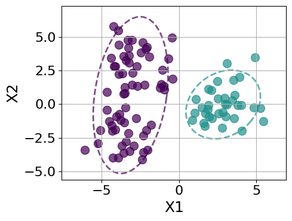
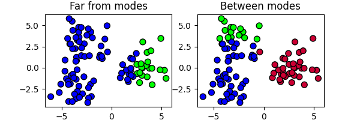

# cbi_partitions: Conformal Bayesian Inference for Random Partition Models

**cbi_partitions** is a Python library for performing Conformal Bayesian Inference (CBI) on partition-valued data (clustering results). It provides valid uncertainty quantification and hypothesis testing for clustering analysis, specifically addressing challenges with multimodal posteriors.

## Installation

You can install this package directly from GitHub into any Python environment (no Git required):

```bash
pip install https://github.com/nbariletto/cbi_partitions/archive/main.zip
```

*Note: The tutorial below requires the `pyrichlet` library for the MCMC sampling step. If you do not have access to this library, you can substitute the sampling step with any standard Bayesian clustering sampler (e.g., Dirichlet Process Mixture Models).*

---

<br>

## Tutorial: Reproducing the Multimodal Experiment

This tutorial provides a step-by-step reproduction of the experiment described in the paper. We simulate a dataset with ambiguous clustering structure, sample the posterior using a Pitman-Yor Process Mixture Model, and use `cbi_partitions` to quantify uncertainty and detect multimodality.


### 1. Data Simulation (Gaussian Mixture)
We generate a dataset of $N=100$ points from a mixture of 3 Gaussian components. The covariance is set to create overlap, inducing posterior uncertainty.

```python
import numpy as np
import matplotlib.pyplot as plt
from collections import Counter
from cbi_partitions import PartitionKDE, PartitionBall

# For MCMC sampling (requires pyrichlet)
from pyrichlet import mixture_models 

# --- Simulation Configuration ---
config = {
    'n_nodes': 100, 
    'p_dim': 2, 
    'n_clusters': 3,
    'seed': 12345
}

def simulate_gmm_data(n_nodes, p_dim, n_clusters, seed):
    np.random.seed(seed)
    means = np.array([[-3, -3], [-3, 3], [3, 0]])
    cov = np.eye(p_dim) * 1.5
    
    true_labels = np.random.randint(0, n_clusters, n_nodes)
    X = np.zeros((n_nodes, p_dim))
    
    for i in range(n_nodes):
        X[i, :] = np.random.multivariate_normal(means[true_labels[i]], cov)
        
    return X, true_labels

X, true_labels = simulate_gmm_data(**config)

# Visualize Ground Truth
plt.figure(figsize=(3, 2))
plt.scatter(X[:,0], X[:,1], c=true_labels, cmap='brg', edgecolor='k', s=50)
plt.show()
```


<br>

### 2. MCMC Sampling (Pitman-Yor Process)
We use a Pitman-Yor Process Mixture Model to sample from the posterior. The parameters $\alpha=0.03$ and $\sigma=0.01$ are chosen to allow for flexibility in the number of clusters.

```python
# --- MCMC Parameters ---
mcmc_config = {
    'n_final_samples': 6000,
    'burn_in': 1000,
    'thinning': 5,
    'alpha': 0.03,
    'py_sigma': 0.01,
}

print("--- Running Pyrichlet MCMC ---")
total_iter = mcmc_config['burn_in'] + (mcmc_config['n_final_samples'] * mcmc_config['thinning'])
p_dim = config['p_dim']

# Initialize Sampler
mm = mixture_models.PitmanYorMixture(
    alpha=mcmc_config['alpha'], 
    pyd=mcmc_config['py_sigma'],
    mu_prior=X.mean(axis=0), 
    lambda_prior=0.01,
    psi_prior=np.eye(p_dim) * 1.5, 
    nu_prior=p_dim + 2,
    rng=config['seed'], 
    total_iter=total_iter,
    burn_in=mcmc_config['burn_in'], 
    subsample_steps=mcmc_config['thinning']
)

# Run Sampler
mm.fit_gibbs(y=X, show_progress=True)

# Extract Partitions
mcmc_partitions = [samp['d'] for samp in mm.sim_params]
partitions = np.array(mcmc_partitions, dtype=np.int64)
```

Below we plot the posterior distribution of the number of clusters implied by our model.

```python
num_clusters = [len(np.unique(p)) for p in mcmc_partitions]
k_counts = Counter(num_clusters)
k_values_all = sorted(k_counts.keys())
k_probs_all = [k_counts[k] / len(mcmc_partitions) for k in k_values_all]

plt.figure(figsize=(6, 4))
plt.bar(k_values_all, k_probs_all, color='skyblue')
plt.xlabel("Number of Clusters (K)")
plt.ylabel("Posterior Probability")
plt.xticks(k_values_all)
plt.grid(axis='y', linestyle='--')
plt.show()
```


<br>

### 3. Conformal Model Initialization
We split the MCMC samples into a **Training Set** (5000 partitions) to estimate the partition density and a **Calibration Set** (1000 partitions) to compute non-conformity scores. We use the **PartitionKDE** model with the Variation of Information (VI) metric.

```python
np.random.seed(42)
indices = np.arange(partitions.shape[0])
np.random.shuffle(indices)

split_idx = int(len(partitions) * 5/6)
train_partitions = partitions[indices[:split_idx]]
calib_partitions = partitions[indices[split_idx:]]

# --- Initialize KDE Model ---
kde = PartitionKDE(
    train_partitions=train_partitions,
    metric='vi',
    gamma=0.5
)

# --- Compute all quantities needed for CBI ---
print("Calibrating KDE model...")
kde.calibrate(calib_partitions)
```

<br>

### 4. Pseudo-MAP point estimate

Given the calibration scores we just computed, we compute the point estimate as the calibration partition with highest pseudo-density score. This is done using the `.get_point_estimate()` method.

```python
point_est_partition = kde.get_point_estimate()

plt.figure(figsize=(6, 4))
plt.scatter(X[:,0], X[:,1], c=point_est_partition, cmap='brg', edgecolor='k', s=50)
plt.show()
```



<br>

### 5. Detecting Multimodality (DPC)
We use Density Peak Clustering (DPC) to visualize the posterior landscape and identify distinct modes.

```python
kde.plot_dpc_decision_graph()
plt.show()
```


There are clearly two modes, corresponding to the two points that stand out as having both a large $\delta$ and $s$ value. Below we plot the corresponding partitions.

```python
modes_idx = kde.get_dpc_modes(s_thresh=0.75, delta_thresh=0.6)

fig, axs = plt.subplots(1, 2, figsize=(12, 4))
for i in range(2):
    axs[i].scatter(X[:,0], X[:,1], c=calib_partitions[modes_idx[i]], cmap='brg', edgecolor='k', s=50)
plt.show()
```


<br>

### 6. Hypothesis Testing
We test four specific clustering hypotheses to see if they are consistent with the data at a significance level of $\alpha=0.1$ (90% confidence).

1.  **The true partition (K=3);**
2.  **The ''collapsed'' partition (K=2):** Merging the two leftmost ground-truth clusters;
3.  **The one-cluster partition;**
4.  **The $n$-cluster partition.**


```python
# Collapsed Partition (merge true leftmost clusters)
collapsed_labels = true_labels.copy()
collapsed_labels[collapsed_labels == 1] = 0

# One-cluster partition (full homogeneity hypothesis)
one_cluster_partition = np.ones(config['n_nodes'])

# 100 cluster partition (full heterogeneity hypothesis)
n_cluster_partition = np.arange(config['n_nodes'])

p_val_true = kde.compute_p_value(true_labels)
p_val_coll = kde.compute_p_value(collapsed_labels)
p_val_one = kde.compute_p_value(one_cluster_partition)
p_val_n = kde.compute_p_value(n_cluster_partition)

# --- P-values ---
print(f"Ground Truth (K=3) p-value:    {p_val_true:.4f}")
print(f"Collapsed (K=2) p-value:       {p_val_coll:.4f}")
print(f"One cluster p-value:           {p_val_one:.4f}")
print(f"100 cluster p-value:           {p_val_n:.4f}")
```

```text
Ground Truth (K=3) p-value:    0.3756
Collapsed (K=2) p-value:       0.6893
One cluster p-value:           0.0010
100 cluster p-value:           0.0010
```

<br>

### 6. Comparison with PartitionBall
Finally, we compare results between the VI-KDE score procedure and VI balls (which are obtained as CBI sets using the VI distance from a point estimator as a non-conformity score, implemented usingusing `PartitionBall`).

2.  **A partition far from both modes, moving away from the ''collapsed'' partition in the opposite direction compared to the true partition.** 
3.  **A partition ''between'' the two modes.**

```python
# 2. Partition far from modes (ertical split)
far_labels = (X[:, 0] > 2.5).astype(np.int64)

# 3. Partition between modes (Collapsed partition with split top-left corner)
between_labels = collapsed_labels.copy()
mask = (between_labels == 0) & (X[:, 1] >= 3.23)
between_labels[mask] = 5

fig, axs = plt.subplots(1, 2, figsize=(8, 3))
for i in range(2):
    axs[i].scatter(X[:,0], X[:,1], c=[far_labels, between_labels][i], cmap='brg', edgecolor='k', s=50)
    axs[i].set_title(["Far from modes","Between modes"][i])
plt.show()
```



We now check what hypothesis testing produces under the VI-KDE metric and VI-ball scores.

```python
# Run conformal tests with KDE score
p_val_far = kde.compute_p_value(far_labels)
p_val_between = kde.compute_p_value(between_labels)

# Initialize VI-ball procedure
ball_model = PartitionBall(
    point_estimate_partition=point_est_partition,
    metric='vi'
)
ball_model.calibrate(calib_partitions)

# Test 'far-from-modes' and 'between-modes' partitions with ball score
p_val_far_ball = ball_model.compute_p_value(far_labels)
p_val_between_ball = ball_model.compute_p_value(between_labels)

# Results
print(f"Far-from-modes partition p-value (KDE):        {p_val_far:.4f}")
print(f"Between-modes partition p-value (KDE):         {p_val_between:.4f}")
print(f"Far-from-modes partition p-value (Ball):       {p_val_far_ball:.4f}")
print(f"Between-modes partition p-value (Ball):        {p_val_between_ball:.4f}")
```

```text
Far-from-modes partition p-value (KDE):        0.0010
Between-modes partition p-value (KDE):         0.0819
Far-from-modes partition p-value (Ball):       0.1399
Between-modes partition p-value (Ball):        0.2587
```


