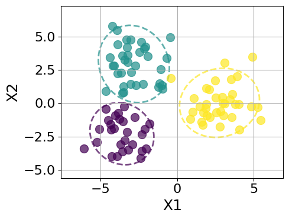
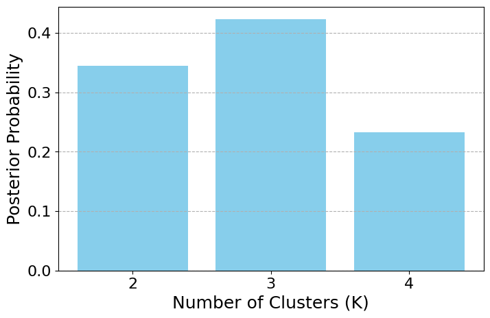
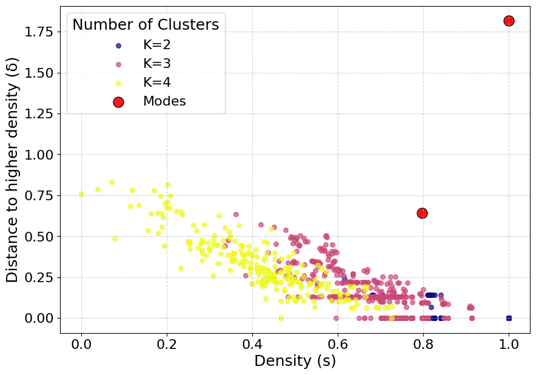
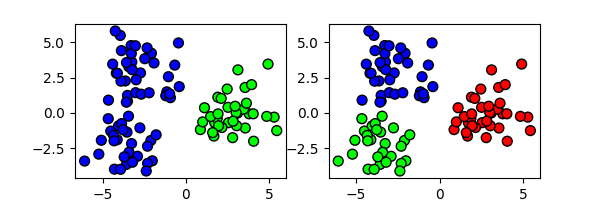
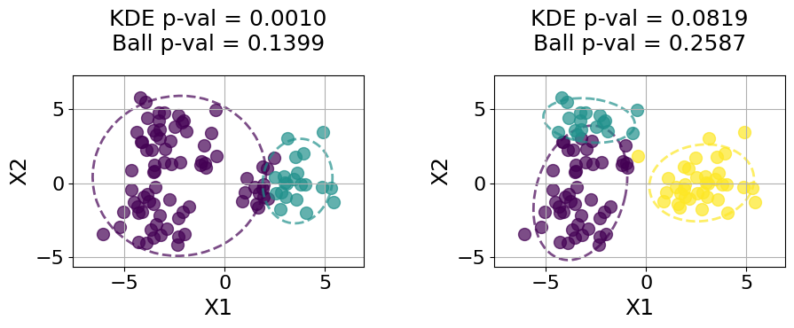

**cbi_partitions** is a Python library for performing Conformal Bayesian Inference (CBI) on MCMC output from random partition models. With a few line of codes it allows you to perform point estimation construct rigorous credible sets and perform valid hypothesis testing on clustering structures, even when the posterior distribution is multimodal.

## Installation

### 1. Clone the Repository
```bash
git clone [https://github.com/nbariletto/cbi_partitions.git](https://github.com/nbariletto/cbi_partitions.git)
cd cbi_partitions
```

### 2. Set Up a Virtual Environment (Recommended)
```bash
# macOS/Linux
python3 -m venv venv
source venv/bin/activate

# Windows
python -m venv venv
venv\Scripts\activate
```

### 3. Install the Package
```bash
pip install .
```

*Note: The tutorial below requires the `pyrichlet` library for the MCMC sampling step. If you do not have access to this library, you can substitute the sampling step with any standard Bayesian clustering sampler (e.g., Dirichlet Process Mixture Models).*

---

## Tutorial: Reproducing the Multimodal Experiment

This tutorial provides a step-by-step reproduction of the experiment described in the paper. We simulate a dataset with ambiguous clustering structure, sample the posterior using a Pitman-Yor Process Mixture Model, and use `cbi_partitions` to quantify uncertainty and detect multimodality.

### 1. Data Simulation (Gaussian Mixture)
We generate a dataset of $N=100$ points from a mixture of 3 Gaussian components. The covariance is set to create overlap, inducing posterior uncertainty.

```python
import numpy as np
import matplotlib.pyplot as plt
from cbi_partitions import PartitionKDE, PartitionBall

# For MCMC sampling (requires pyrichlet)
from pyrichlet import mixture_models 

# --- Simulation Configuration ---
config = {
    'n_nodes': 100, 
    'p_dim': 2, 
    'n_clusters_true': 3,
    'seed': 12345
}

def simulate_gmm_data(n_nodes, p_dim, n_clusters, seed):
    np.random.seed(seed)
    # Means arranged to create ambiguity between 2 and 3 clusters
    means = np.array([[-3, -3], [-3, 3], [3, 0]])
    cov = np.eye(p_dim) * 1.5
    
    true_labels = np.random.randint(0, n_clusters, n_nodes)
    X = np.zeros((n_nodes, p_dim))
    
    for i in range(n_nodes):
        X[i, :] = np.random.multivariate_normal(means[true_labels[i]], cov)
        
    return X, true_labels

X, true_labels = simulate_gmm_data(**config)

# Visualize Ground Truth
plt.figure(figsize=(6, 5))
plt.scatter(X[:,0], X[:,1], c=true_labels, cmap='viridis', edgecolor='k', s=50)
plt.title("Ground Truth Partition (K=3)")
plt.savefig("images/true_partition.png", dpi=300)
plt.show()
```



### 2. MCMC Sampling (Pitman-Yor Process)
We use a Pitman-Yor Process Mixture Model to sample from the posterior. The parameters $\alpha=0.03$ and $\sigma=0.01$ are chosen to allow for flexibility in the number of clusters.

```python
# --- MCMC Parameters ---
mcmc_config = {
    'n_final_samples': 6000,
    'burn_in': 1000,
    'thinning': 5,
    'alpha': 0.03,
    'py_sigma': 0.01, # Discount parameter
}

print("--- Running Pyrichlet MCMC ---")
total_iter = mcmc_config['burn_in'] + (mcmc_config['n_final_samples'] * mcmc_config['thinning'])
p_dim = config['p_dim']

# Initialize Sampler
mm = mixture_models.PitmanYorMixture(
    alpha=mcmc_config['alpha'], 
    pyd=mcmc_config['py_sigma'],
    mu_prior=X.mean(axis=0), 
    lambda_prior=0.01,
    psi_prior=np.eye(p_dim) * 1.5, 
    nu_prior=p_dim + 2,
    rng=config['seed'], 
    total_iter=total_iter,
    burn_in=mcmc_config['burn_in'], 
    subsample_steps=mcmc_config['thinning']
)

# Run Sampler
mm.fit_gibbs(y=X, show_progress=True)

# Extract Partitions
mcmc_partitions = [samp['d'] for samp in mm.sim_params]
partitions = np.array(mcmc_partitions, dtype=np.int64)
print(f"Collected {partitions.shape[0]} posterior samples.")
```



### 3. Conformal Model Initialization
We split the MCMC samples into a **Training Set** (5/6 of data) to estimate the partition density and a **Calibration Set** (1/6 of data) to compute non-conformity scores. We use the **PartitionKDE** model with the Variation of Information (VI) metric.

```python
# --- Split Data (5/6 Train, 1/6 Calibration) ---
np.random.seed(42)
indices = np.arange(partitions.shape[0])
np.random.shuffle(indices)

split_idx = int(len(partitions) * 5/6)
train_partitions = partitions[indices[:split_idx]]
calib_partitions = partitions[indices[split_idx:]]

# --- Initialize KDE Model ---
kde = PartitionKDE(
    train_partitions=train_partitions,
    metric='vi',
    gamma=0.5
)

# --- Calibrate ---
print("Calibrating KDE model...")
kde.calibrate(calib_partitions)
```

### 4. Detecting Multimodality (DPC)
Standard summary statistics (like the MAP estimate) can be misleading if the posterior is multimodal. We use **Density Peak Clustering (DPC)** to visualize the posterior landscape and identify distinct modes.

```python
# 1. Get Global Point Estimate
point_est_partition = kde.get_point_estimate()

# 2. Plot Decision Graph
# 's': Local Density | 'delta': Distance to nearest point with higher density
kde.plot_dpc_decision_graph()
plt.savefig("images/dpc_decision_graph.png", dpi=300)
plt.show()

# 3. Extract Modes
modes = kde.get_dpc_modes(s_thresh=0.75, delta_thresh=0.6)
print(f"Found {len(modes)} modes in the posterior.")
```



The presence of multiple peaks in the decision graph (high density, high separation) confirms the posterior is multimodal.



### 5. Hypothesis Testing
We test three specific clustering hypotheses to see if they are consistent with the data at a significance level of $\alpha=0.1$ (90% confidence).

1.  **Collapsed (K=2):** Merging the two closest ground-truth clusters (0 and 1).
2.  **X1-Split (K=2):** Splitting the data purely based on the X1 coordinate ($X_1 > 2.5$).
3.  **Split-Collapsed (K=3):** A hybrid partition that merges clusters 0 and 1, but splits off a new group based on X2.

```python
ALPHA_CONF = 0.1

# --- Define Test Partitions ---

# 1. Collapsed Partition (Merge clusters 0 and 1)
collapsed_labels = true_labels.copy()
collapsed_labels[collapsed_labels == 1] = 0 

# 2. X1-Split Partition (Vertical split)
x1_split_labels = (X[:, 0] > 2.5).astype(np.int64)

# 3. Split-Collapsed Partition (Merge 0+1, but split top corner)
split_collapsed_labels = collapsed_labels.copy()
mask = (split_collapsed_labels == 0) & (X[:, 1] >= 3.2)
split_collapsed_labels[mask] = 2

# --- Run Conformal Tests ---
p_val_true = kde.compute_p_value(true_labels)
p_val_coll = kde.compute_p_value(collapsed_labels)
p_val_x1 = kde.compute_p_value(x1_split_labels)
p_val_split_coll = kde.compute_p_value(split_collapsed_labels)

# --- Output Results ---
print(f"Ground Truth (K=3) p-value:    {p_val_true:.4f}")
print(f"Collapsed (K=2) p-value:       {p_val_coll:.4f}")
print(f"X1-Split (K=2) p-value:        {p_val_x1:.4f}")
print(f"Split-Collapsed (K=3) p-value: {p_val_split_coll:.4f}")
```

### 6. Comparison with PartitionBall
We also compare the results using `PartitionBall`, a simpler conformal model based on fixed-radius balls around the point estimate (rather than density estimation).

```python
# Initialize and Calibrate
ball_model = PartitionBall(
    point_estimate_partition=point_est_partition,
    metric='vi'
)
ball_model.calibrate(calib_partitions)

# Test 'X1-Split' and 'Split-Collapsed'
p_val_x1_ball = ball_model.compute_p_value(x1_split_labels)
p_val_split_coll_ball = ball_model.compute_p_value(split_collapsed_labels)

print(f"X1-Split Ball p-value:       {p_val_x1_ball:.4f}")
print(f"Split-Collapsed Ball p-value:{p_val_split_coll_ball:.4f}")
```

### Visualizing Results
The figure below visualizes the partitions we tested and their resulting acceptance/rejection status.



